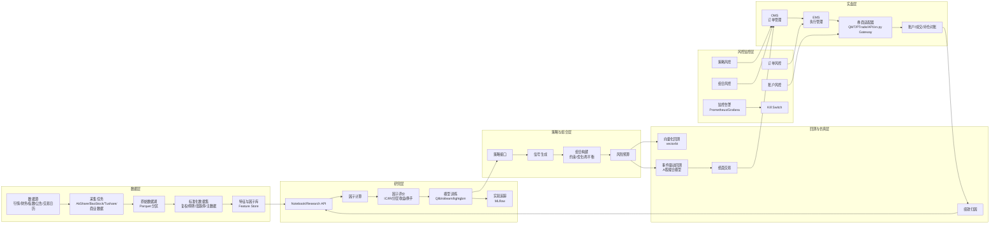
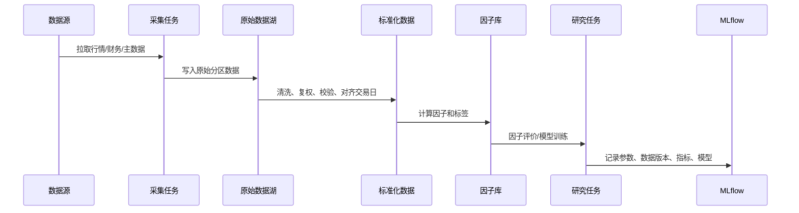
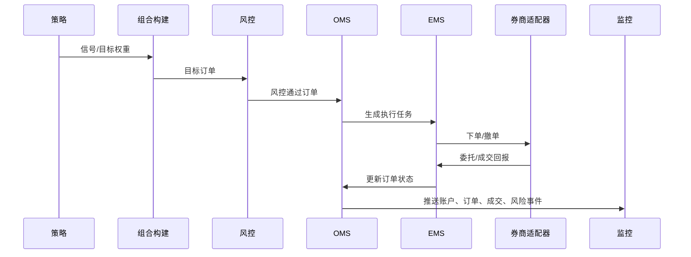

# 国内股票量化交易系统技术选型与架构方案

版本：v0.1  
日期：2026-05-17  
方向：A 股股票，优先覆盖日频和分钟级策略，后续可扩展到实时盘口、两融、ETF、可转债和期权。

## 1. 建设目标

本系统面向国内股票量化研究、回测、仿真和实盘交易，目标不是一次性自研完整交易平台，而是采用“自有数据与研究中台 + 开源框架 + 券商适配层”的方式逐步落地。

核心目标：

- 建立可复现的数据链路：原始数据、清洗数据、复权数据、因子数据、回测输入都可追踪。
- 支持完整研究流程：选股池、因子计算、因子评价、组合构建、回测、归因和复盘。
- 支持 A 股交易规则：T+1、涨跌停、停牌、ST、退市整理、最小交易单位、手续费、印花税、过户费、复权。
- 支持从研究到实盘的逐步迁移：离线研究、事件驱动回测、纸面交易、小资金实盘。
- 建立独立风控体系：策略风控、组合风控、账户风控、订单风控、异常行情保护和 kill switch。
- 尽量避免单一框架锁定：策略、数据、回测和执行之间使用内部标准接口解耦。

非目标：

- 第一版不做毫秒级高频交易。
- 第一版不直接覆盖期货、期权和数字货币。
- 第一版不追求复杂前端交易终端，先以 CLI、Notebook、报表和监控面板为主。

## 2. 技术选型结论

### 2.1 总体推荐

| 环节 | 推荐选型 | 说明 |
|---|---|---|
| 主要语言 | Python 3.11+ | 国内量化生态、数据分析、开源框架支持最好 |
| 包管理 | uv 或 Poetry | 固定依赖版本，方便复现实验 |
| 数据采集 | AkShare、BaoStock、Tushare Pro、券商/数据商 API | 免费源用于早期验证，生产环境建议接商业数据 |
| 原始数据存储 | Parquet + MinIO/S3 或本地对象目录 | 成本低、易分区、适合历史数据归档 |
| 分析型查询 | DuckDB 起步，后续 ClickHouse | DuckDB 适合单机研究，ClickHouse 适合多用户和大规模分钟数据 |
| 元数据/任务状态 | PostgreSQL | 管理证券主数据、任务状态、实验索引、交易记录 |
| 数据处理 | pandas、polars、numpy、pyarrow | polars 适合批处理，pandas 适合生态兼容 |
| 因子研究 | Qlib + 自研因子库 | Qlib 适合 AI/因子研究，自研层用于适配 A 股规则 |
| 快速回测 | vectorbt + 自研 A 股规则封装 | 高速参数扫描和因子初筛 |
| 事件驱动回测 | 自研轻量引擎优先，必要时接 vn.py/Backtrader | A 股规则细节多，自研撮合模型更可控 |
| 实盘框架 | vn.py 作为参考/适配候选，实际执行优先适配券商 QMT/PTrade/API | 国内股票券商接口差异大，执行层必须抽象 |
| 实验追踪 | MLflow | 记录参数、数据版本、代码版本、指标和模型 |
| 调度系统 | Prefect 起步，后续 Airflow | 早期 Prefect 更轻，任务复杂后可迁移 Airflow |
| 配置管理 | Pydantic + YAML/TOML | 配置校验、环境隔离、策略参数管理 |
| 报表 | Jupyter、Plotly、Quarto/Markdown | 先保证研究和复盘可读 |
| 监控 | Prometheus + Grafana + Alertmanager | 实盘前必须建设 |
| 部署 | Docker Compose 起步，后续 Kubernetes | 先降低运维复杂度 |

### 2.2 开源框架取舍

#### Qlib

用于因子研究、机器学习建模、数据集切分、模型训练和评估。适合做 alpha research，但不建议直接作为唯一实盘框架。

使用方式：

- 引入其研究范式和部分数据/模型接口。
- 将 Qlib 输出统一转成内部 `Signal` 或 `TargetWeight`。
- 模型训练和评估结果进入 MLflow。

#### vectorbt

用于高速向量化回测、参数扫描、因子初筛和组合对比。它适合快速回答“这个想法有没有粗略价值”，但不适合单独承担真实 A 股撮合约束。

使用方式：

- 做日频或分钟级的快速粗筛。
- 封装 A 股成本、涨跌停、停牌、T+1 等规则。
- 通过统一指标模块和事件回测结果对齐。

#### vn.py

vn.py 在国内交易接口、事件驱动、策略应用和交易网关方面有价值，尤其适合参考其实盘架构。但对于股票实盘，最终仍取决于具体券商接口可用性。

使用方式：

- 第一阶段作为架构参考，不作为研究核心依赖。
- 第二阶段评估其股票相关 gateway 是否匹配目标券商。
- 若不匹配，则保留内部交易接口，单独实现 QMT/PTrade/券商 API 适配器。

#### Backtrader / Zipline-reloaded

适合作为学习和原型参考，但 A 股细节适配成本不低。对于本项目，优先级低于自研轻量事件回测和 vectorbt。

#### LEAN / NautilusTrader

工程化程度高，但对国内股票数据、交易日历、券商接口和规则适配成本较高。短期不建议作为 A 股项目主框架，除非未来明确要做多市场、多资产、海外扩展。

## 3. 系统总体架构



## 4. 模块设计

### 4.1 数据层

数据层是本系统的地基。国内股票数据容易出现复权口径不一致、停牌状态遗漏、指数成分历史漂移、财务发布时间错用等问题，因此必须从第一版就做数据版本管理。

核心数据集：

- `security_master`：证券主数据，包含股票代码、名称、上市日期、退市日期、交易所、板块、是否 ST。
- `trade_calendar`：交易日历，包含交易日、节假日、半日交易等。
- `daily_bar`：日线行情，包含开高低收、成交量、成交额、前收盘、涨跌停价格。
- `minute_bar`：分钟线行情，后续阶段引入。
- `adjust_factor`：前复权/后复权因子。
- `suspension`：停复牌数据。
- `limit_price`：涨跌停价格。
- `index_member`：指数成分股历史。
- `industry_classification`：行业分类历史。
- `financial_statement`：财报数据。
- `announcement`：公告数据，后续可引入 NLP。
- `factor_value`：因子值。
- `label_value`：收益标签、风险标签。

推荐目录结构：

```text
data/
  raw/
    vendor=akshare/table=daily_bar/year=2026/
  clean/
    table=daily_bar/adj=none/year=2026/
    table=daily_bar/adj=forward/year=2026/
  feature/
    factor=momentum_20/version=v1/date=2026-05-15/
  model/
  report/
```

关键原则：

- 所有数据都带 `source`、`as_of_date`、`ingested_at`、`version`。
- 财务数据必须使用公告日或可得日，避免未来函数。
- 指数成分、行业分类、ST 状态必须保留历史，不允许只用当前状态。
- 回测只读取指定数据版本，不能读取“最新覆盖”的隐式数据。

### 4.2 研究层

研究层负责把数据变成可评估的策略假设。

主要能力：

- 股票池构建：全 A、沪深 300、中证 500、中证 1000、创业板、行业池、自定义池。
- 过滤规则：上市不足 N 日、ST、停牌、涨跌停不可买卖、成交额过低、价格过低、退市风险。
- 因子计算：动量、反转、波动率、成交量、换手、估值、成长、质量、盈利、情绪。
- 因子处理：去极值、缺失值处理、标准化、行业/市值中性化。
- 因子评价：IC、Rank IC、ICIR、分层收益、多空组合、换手、衰减、行业暴露。
- 模型训练：LightGBM、XGBoost、线性模型、Rank 模型、Qlib 模型。

研究输出统一为：

```python
Signal(
    trade_date="2026-05-15",
    symbol="000001.SZ",
    score=0.83,
    direction="long",
    horizon=5,
    metadata={"model": "lgbm_v3", "factor_set": "alpha_001"}
)
```

### 4.3 策略与组合层

策略层只负责表达观点，组合层负责决定仓位。两者必须分离。

策略层输出：

- `Signal`：单票打分或方向。
- `TargetWeight`：目标权重。
- `OrderIntent`：交易意图，不直接等同真实订单。

组合层处理：

- 持仓数量限制，例如 30、50、100 只。
- 单票最大权重。
- 行业偏离限制。
- 风格暴露限制。
- 换手率限制。
- 现金比例。
- 停牌和涨跌停处理。
- T+1 卖出限制。
- 交易成本和冲击成本。

推荐第一版组合构建：

- 多因子打分排序。
- 每周或每日调仓。
- 等权或波动率倒数加权。
- 单票权重上限 2%-5%。
- 剔除 ST、停牌、上市不足 60 日、最近 20 日日均成交额低于阈值股票。

### 4.4 回测层

回测层分两类，分别解决不同问题。

#### 向量化回测

用途：

- 快速验证因子有效性。
- 参数扫描。
- 股票池和调仓频率对比。
- 策略初筛。

技术：

- vectorbt。
- pandas/polars 自研矩阵计算。

限制：

- 对订单状态、部分成交、涨跌停不可成交、T+1 处理不够自然。
- 结果只能作为初筛，不能直接作为实盘依据。

#### 事件驱动回测

用途：

- 模拟真实交易流程。
- 验证订单、成交、持仓、资金、成本、滑点。
- 与纸面交易和实盘接口保持一致。

必须支持的 A 股规则：

- T+1：当日买入股票不可当日卖出。
- 交易单位：买入通常为 100 股整数倍，卖出可处理零股。
- 涨跌停：涨停通常不可买入成交，跌停通常不可卖出成交，需要基于盘口或保守规则模拟。
- 停牌：不可交易。
- 手续费：佣金、最低佣金、印花税、过户费。
- 价格撮合：开盘价、收盘价、VWAP、下一 bar 成交、限价单撮合。
- 现金约束：不能超额买入。
- 分红送转：复权、现金分红、股份变动。

第一版事件回测可采用保守撮合：

- 信号在 T 日收盘后生成。
- T+1 日按开盘价或 VWAP 调仓。
- 若 T+1 日停牌或买入涨停，则买单失败。
- 若 T+1 日卖出跌停，则卖单失败。
- 买入按 100 股取整。
- 成本使用固定佣金 + 印花税 + 过户费 + 滑点。

### 4.5 实盘交易层

实盘交易层建议不要直接绑定某个开源框架，而是定义内部标准接口。

核心接口：

```python
class BrokerAdapter:
    def connect(self) -> None: ...
    def get_account(self) -> Account: ...
    def get_positions(self) -> list[Position]: ...
    def get_orders(self) -> list[Order]: ...
    def get_trades(self) -> list[Trade]: ...
    def submit_order(self, order: OrderRequest) -> OrderId: ...
    def cancel_order(self, order_id: OrderId) -> None: ...
```

候选实盘适配：

- 券商 QMT / MiniQMT。
- 券商 PTrade。
- 券商专用 API。
- vn.py gateway，如果目标券商和接口匹配。

实盘前置要求：

- 必须完成纸面交易。
- 必须具备订单风控。
- 必须具备交易日志和对账。
- 必须具备人工暂停和一键撤单。
- 必须使用小资金灰度上线。

### 4.6 风控层

风控层独立于策略运行，策略不能绕过风控直接下单。

风控分类：

| 风控类型 | 规则示例 |
|---|---|
| 订单风控 | 单笔金额上限、单票数量上限、价格偏离限制、禁止市价追涨 |
| 持仓风控 | 单票权重上限、行业权重上限、总仓位上限 |
| 账户风控 | 日亏损上限、最大回撤、可用资金下限 |
| 策略风控 | 策略亏损熔断、连续异常信号暂停 |
| 市场风控 | 指数大跌暂停买入、行情延迟暂停交易 |
| 系统风控 | 数据延迟、网关断连、成交回报异常、对账失败 |

最低上线标准：

- 日内亏损达到阈值自动停止开新仓。
- 订单金额超过阈值需要拦截。
- 行情更新时间超过阈值暂停交易。
- 持仓和券商账户对账不一致暂停交易。
- 全局 kill switch 可用。

### 4.7 监控与复盘

实时监控：

- 行情延迟。
- 数据采集任务状态。
- 策略进程状态。
- 账户权益、现金、持仓。
- 当日盈亏、回撤、成交金额、换手。
- 订单成功率、撤单率、拒单率。
- 风控拦截次数。
- 券商连接状态。

盘后复盘：

- 收益曲线。
- 超额收益。
- 最大回撤。
- 年化收益、波动率、夏普、Calmar。
- 持仓贡献。
- 行业贡献。
- 因子暴露。
- 交易成本。
- 滑点。
- 未成交订单分析。
- 回测、纸面和实盘偏差分析。

## 5. 推荐项目结构

```text
qtrade/
  docs/
    domestic_stock_quant_system.md
  pyproject.toml
  configs/
    data/
    strategy/
    broker/
    risk/
  qtrade/
    core/
      calendar.py
      types.py
      events.py
      config.py
    data/
      collectors/
      storage/
      loaders/
      validators/
      adjust.py
    features/
      factors/
      neutralize.py
      pipeline.py
    research/
      universe.py
      evaluation.py
      notebooks/
    strategy/
      base.py
      signals.py
      portfolio.py
    backtest/
      vectorized.py
      event_engine.py
      broker_sim.py
      cost.py
      slippage.py
    risk/
      rules.py
      engine.py
    execution/
      oms.py
      ems.py
      adapters/
        qmt.py
        ptrade.py
        vnpy_gateway.py
    report/
      performance.py
      attribution.py
    ops/
      scheduler.py
      monitoring.py
  tests/
    unit/
    integration/
    backtest_cases/
```

## 6. 数据流与交易流

### 6.1 研究数据流



### 6.2 实盘交易流



## 7. 迭代计划

### 阶段 0：项目初始化，1 周

目标：

- 建立 Python 项目骨架。
- 确定数据源和目标券商。
- 定义内部核心数据结构。
- 明确第一批策略类型。

交付物：

- `pyproject.toml`。
- 配置目录。
- 核心类型定义：`Bar`、`Signal`、`Position`、`Order`、`Trade`、`Portfolio`。
- 数据源调研结论。

验收标准：

- 项目可安装。
- 单元测试可运行。
- 有一份样例配置可以加载。

### 阶段 1：日频数据与基础研究，2-4 周

目标：

- 拉取 A 股日频行情、交易日历、股票主数据、复权因子。
- 建立标准化数据存储。
- 实现股票池和基础因子。

交付物：

- 日线数据采集器。
- 复权处理。
- 基础数据校验。
- 股票池构建。
- 5-10 个基础因子。
- 因子评价报告。

验收标准：

- 可以复现指定日期的股票池。
- 可以计算全市场日频因子。
- 可以输出 IC、分层收益和换手报告。

### 阶段 2：向量化回测 MVP，2-3 周

目标：

- 基于 vectorbt 或自研矩阵计算完成快速回测。
- 支持多因子选股、定期调仓和成本估算。

交付物：

- `VectorizedBacktester`。
- 手续费和滑点模型。
- 多因子策略样例。
- 回测报告模板。

验收标准：

- 能跑完 5 年全 A 或主要指数成分池回测。
- 能输出收益、回撤、换手、持仓、行业分布。
- 支持参数扫描。

### 阶段 3：事件驱动回测，4-6 周

目标：

- 模拟真实 A 股订单、成交、持仓和现金变化。
- 支持 T+1、涨跌停、停牌和交易单位。

交付物：

- 事件驱动回测引擎。
- 模拟撮合器。
- 成本模型。
- 账户和持仓模块。
- 与向量化回测的对比报告。

验收标准：

- 同一策略在向量化回测和事件回测中结果方向一致。
- 可解释差异来源，例如不可成交、取整、成本、T+1。
- 回测日志可追踪每一笔订单和成交。

### 阶段 4：纸面交易，4-8 周

目标：

- 接入实时或准实时行情。
- 每日生成信号、目标仓位和模拟订单。
- 建立实盘前监控和风控。

交付物：

- Paper broker。
- 实时/准实时行情接入。
- 风控引擎 MVP。
- 交易日报。
- 监控面板。

验收标准：

- 连续运行至少 20 个交易日。
- 每日可完成信号生成、模拟调仓、盘后复盘。
- 异常行情、停牌、涨跌停、资金不足能被正确处理。

### 阶段 5：小资金实盘，1-3 个月

目标：

- 接入目标券商交易接口。
- 小资金、低频、低风险上线。
- 建立对账和故障恢复机制。

交付物：

- 券商适配器。
- OMS/EMS MVP。
- 实盘风控规则。
- 一键暂停和撤单。
- 盘后对账。

验收标准：

- 小资金实盘稳定运行。
- 订单、成交、持仓、资金与券商端一致。
- 风控拦截、异常暂停、手动恢复流程可用。

### 阶段 6：组合化与平台化，持续迭代

目标：

- 多策略、多账户、多组合管理。
- 引入策略分配、风险预算、模型注册和自动化报告。

交付物：

- 多策略资金分配。
- 策略相关性分析。
- MLflow 模型注册流程。
- 自动调度 DAG。
- 策略上线审批流程。

验收标准：

- 可以同时运行多策略。
- 可以按风险预算动态分配资金。
- 每个策略版本、数据版本和实盘表现可追踪。

## 8. 第一版 MVP 推荐范围

第一版不要贪大，建议只做一个完整闭环：

- 市场：A 股。
- 频率：日频。
- 交易方式：收盘后生成信号，次日开盘或 VWAP 调仓。
- 策略：多因子选股。
- 股票池：沪深 300 / 中证 500 / 中证 1000 三选一。
- 持仓数量：30-100 只。
- 调仓频率：周频或月频。
- 回测周期：至少 5 年。
- 实盘阶段：先纸面交易，再小资金。

MVP 策略示例：

- 剔除 ST、停牌、上市不足 60 日、低流动性股票。
- 因子：20 日动量、60 日反转、20 日波动率、成交额、换手率、市值。
- 因子处理：去极值、标准化、行业中性化。
- 排名前 N 买入。
- 单票等权。
- 每周调仓。
- 单票权重不超过 3%。
- 总仓位不超过 95%。

## 9. 关键风险

### 数据风险

- 免费数据源存在缺失、延迟、修正和口径不一致。
- 财务数据容易出现未来函数。
- 复权口径不一致会导致回测严重失真。

应对：

- 建立数据校验。
- 保留数据版本。
- 生产环境逐步切换到稳定商业数据源。

### 回测风险

- 忽略涨跌停、停牌、T+1 和交易单位会高估收益。
- 手续费、冲击成本和未成交处理会显著影响结果。

应对：

- 第一版事件回测采用保守成交假设。
- 盘后对比纸面交易和回测差异。

### 实盘风险

- 券商接口稳定性和权限差异大。
- 自动交易存在误下单、重复下单、断线状态不一致风险。

应对：

- 先纸面交易。
- 小资金灰度。
- 所有订单经过 OMS、EMS 和风控。
- 建立人工暂停和撤单机制。

### 策略风险

- 因子过拟合。
- 数据挖掘偏差。
- 风格暴露过高。
- 市场环境变化。

应对：

- 样本外测试。
- 滚动回测。
- 因子衰减监控。
- 策略容量和换手分析。
- 实盘表现与回测持续对比。

## 10. 外部参考

- vn.py / VeighNa：<https://www.vnpy.com/>
- Qlib：<https://qlib.readthedocs.io/>
- vectorbt：<https://vectorbt.dev/>
- MLflow Model Registry：<https://mlflow.org/docs/>
- Apache Airflow：<https://airflow.apache.org/docs/>
- NautilusTrader：<https://nautilustrader.io/docs/latest/>
- QuantConnect LEAN：<https://www.quantconnect.com/docs/>

## 11. 下一步建议

建议下一步先落地“阶段 0 + 阶段 1”的代码骨架：

1. 初始化 Python 项目和配置系统。
2. 定义核心领域模型。
3. 接入一个免费数据源用于开发验证。
4. 完成日线数据落盘。
5. 做一个沪深 300 多因子选股回测样例。

完成这个闭环后，再决定是否引入 Qlib 深度研究、是否接入 vn.py 或券商专用接口进入纸面交易。
